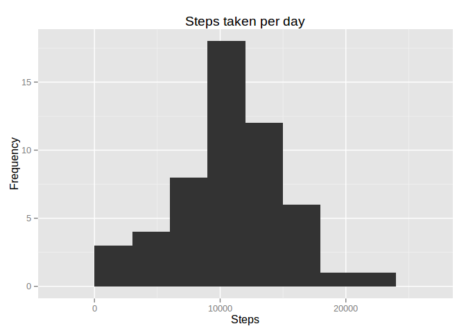
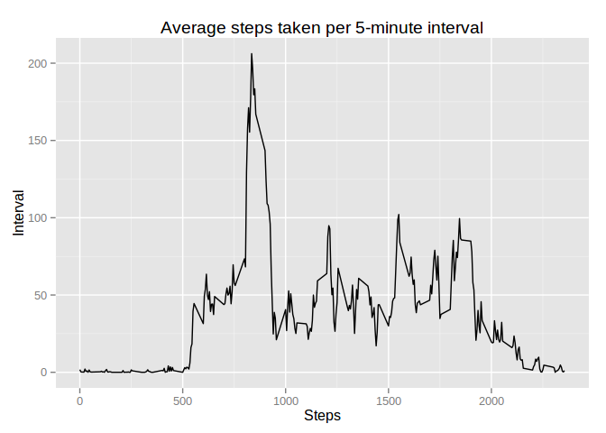
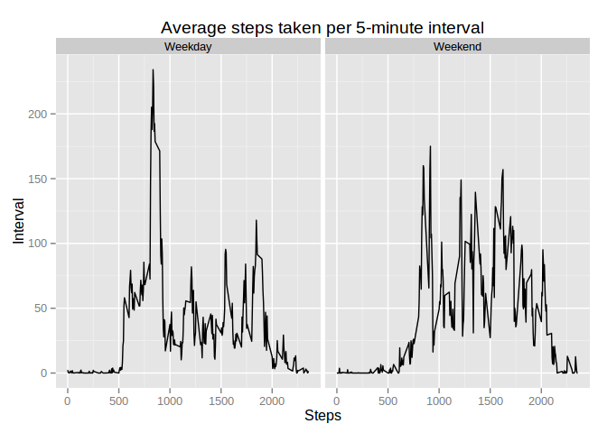

# Reproducible Research: Peer Assessment 1

## Loading and preprocessing the data

```r
# CSV file was previously extracted from activity.zip
data <- read.csv("activity.csv", header=TRUE)

# Convert date column to Date class
data$date = as.Date(data$date)
```

## What is mean total number of steps taken per day?

```r
library(ggplot2)
library(reshape2)

melted <- melt(data, id=c("date"))
dailySteps <- dcast(melted, date~variable, sum)

s <- ggplot(dailySteps, aes(steps))
s + geom_histogram(binwidth=3000) +
  ggtitle("Steps taken per day") +
  xlab("Steps") +
  ylab("Frequency")
```

 


```r
# Disable scientific notation
options(scipen=999)

stepsMean <- mean(dailySteps$steps, na.rm=TRUE)
stepsMedian <- median(dailySteps$steps, na.rm=TRUE)
```

* Mean steps per day: 10766.1886792
* Median steps per day: 10765

## What is the average daily activity pattern?

```r
intervalSteps <- aggregate(steps ~ interval, data, mean)

s <- ggplot(intervalSteps, aes(interval, steps))
s + geom_line() +
  ggtitle("Average steps taken per 5-minute interval") +
  xlab("Steps") +
  ylab("Interval")
```

 


```r
intervalSteps[which.max(intervalSteps$steps), "interval"]
```

```
## [1] 835
```

## Imputing missing values

```r
nrow(data[is.na(data$steps),])
```

```
## [1] 2304
```


```r
# Replace missing step values with mean value across all days for the interval
imputedData <- data

for (i in 1:nrow(imputedData)) {
  if (is.na(imputedData[i, "steps"])) {
    imputedData[i, "steps"] <- mean(imputedData[imputedData$interval==imputedData[i, "interval"], "steps"])
  }
}
```


```r
melted <- melt(imputedData, id=c("date"))
dailySteps <- dcast(melted, date~variable, sum)

s <- ggplot(dailySteps, aes(steps))
s + geom_histogram(binwidth=3000) +
  ggtitle("Steps taken per day") +
  xlab("Steps") +
  ylab("Frequency")
```

 


```r
# Disable scientific notation
options(scipen=999)

stepsMean <- mean(dailySteps$steps, na.rm=TRUE)
stepsMedian <- median(dailySteps$steps, na.rm=TRUE)
```

* Mean steps per day: 10766.1886792
* Median steps per day: 10765

## Are there differences in activity patterns between weekdays and weekends?

```r
imputedData$weekend <- as.factor(ifelse(weekdays(imputedData$date) %in% c("Saturday", "Sunday"), "Weekend", "Weekday"))
```


```r
intervalSteps <- aggregate(steps ~ interval + weekend, imputedData, mean)

s <- ggplot(intervalSteps, aes(interval, steps))
s + geom_line() +
  ggtitle("Average steps taken per 5-minute interval") +
  facet_grid(. ~ weekend) +
  xlab("Steps") +
  ylab("Interval")
```

 
